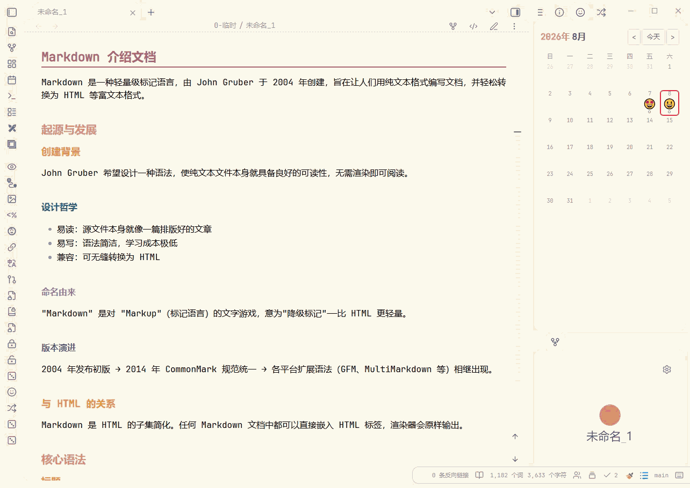

# Subtle TOC Plus

> 本项目基于 [xupisco/obsidian-suble-toc](https://github.com/xupisco/obsidian-suble-toc) 进行修改与扩展。
> 感谢原作者优秀的开源工作！
>
> This project is modified and extended from [xupisco/obsidian-suble-toc](https://github.com/xupisco/obsidian-suble-toc).
> Thanks to the original author for the excellent open-source work!

## 项目简介 / Overview

Subtle TOC Plus 是一个适用于 Obsidian 的轻量悬浮目录插件。它会在笔记边缘显示细线式标题缩略图，并在弹出面板中展示标题与待办任务（可通过“显示标签栏”开关显示标题/任务标签栏），帮助你快速浏览长文结构、跳转到对应位置，并处理未完成任务。

Subtle TOC Plus is a lightweight floating table-of-contents plugin for Obsidian. It shows a subtle heading minimap on the edge of the note and opens a popover with headings and open tasks (the Headings/Tasks tab bar can be shown with the "Show tab bar" toggle), making it easier to scan long notes, jump to sections, and handle unfinished tasks.

## 👀 预览 / Preview

## ✨ 新增功能 / New Features

| 功能 | 描述 | 默认值 |
| --- | --- | --- |
| 中英文界面 | 目录面板和设置页支持 English / 中文切换。 | English |
| 更干净的标题显示 | 隐藏 Markdown 反斜杠转义字符，例如 `1\.` 会显示为 `1.`。 | 始终启用 |
| 面板固定 | 可通过顶部图钉按钮固定或取消固定目录面板。 | 未固定 |
| 标题层级折叠 | 支持折叠/展开单个标题分支，并可一键展开或收起全部目录项。 | 全部展开 |
| 标题搜索 | 新增搜索按钮，可快速筛选标题，并支持一键清空搜索内容。 | 关闭搜索 |
| 面板尺寸与透明度 | 可自定义面板高度、面板背景透明度和标题文字透明度。 | 高度跟随默认值（50vh）；背景透明度 100%；文字透明度 100% |
| 工具栏与标签栏显示控制 | 可隐藏顶部工具栏，也可隐藏标题/任务标签栏。 | 工具栏开启；标签栏开启 |
| H1-H6 级别徽标 | 标题右侧可显示层级徽标，默认使用 Rose Pine 配色，并支持分别自定义 6 个级别的颜色。 | 开启；`#b4637a`、`#d7827e`、`#ea9d34`、`#286983`、`#907aa9`、`#575279` |
| 徽标颜色输入规范化 | 颜色设置支持带或不带 `#` 的十六进制值，也支持 3 位十六进制值自动展开。 | 始终启用 |
| 设置项恢复默认值 | 每个设置项都提供独立的恢复默认值按钮。 | 可用 |
| 失焦自动隐藏 | 可选择在焦点离开 Markdown 笔记时自动隐藏目录面板。 | 关闭 |

| Feature | Description | Default |
| --- | --- | --- |
| Bilingual UI | Switch the TOC panel and settings page between English and Chinese. | English |
| Cleaner heading text | Markdown escape backslashes are hidden, so `1\.` is displayed as `1.`. | Always enabled |
| Panel pinning | Pin or unpin the TOC popover from the toolbar. | Unpinned |
| Heading tree folding | Collapse or expand individual heading branches, with an expand-all/collapse-all toolbar button. | Fully expanded |
| Heading search | Search headings directly from the popover and clear the query with one click. | Search closed |
| Panel size and opacity | Customize panel height, panel background opacity, and heading text opacity. | Default height (50vh); background opacity 100%; text opacity 100% |
| Toolbar and tab-bar visibility | Hide the top toolbar or the Headings/Tasks tab bar when you want a cleaner panel. | Toolbar on; tab bar on |
| H1-H6 level badges | Show heading-level badges on the right side of each heading, with Rose Pine-inspired defaults and six customizable colors. | On; `#b4637a`, `#d7827e`, `#ea9d34`, `#286983`, `#907aa9`, `#575279` |
| Badge color normalization | Badge colors accept hex values with or without `#`, and 3-digit hex values are expanded automatically. | Always enabled |
| Per-setting reset buttons | Every setting can be reset to its default value independently. | Available |
| Auto-hide on blur | Optionally hide the TOC when focus moves away from the Markdown note. | Off |

## 📦 安装 / Installation

### 从 Obsidian 社区插件安装（推荐）/ From Obsidian Community Plugins (recommended)

1. 打开 Obsidian -> **设置 -> 第三方插件**。
2. 点击 **浏览**，搜索 **Subtle TOC Plus**。
3. 点击 **安装**，然后 **启用**。

---

1. Open Obsidian -> **Settings -> Community plugins**.
2. Click **Browse** and search for **Subtle TOC Plus**.
3. Click **Install**, then **Enable**.

### 从 GitHub Releases 安装 / From GitHub Releases

1. 从最新 [release](../../releases) 下载 `main.js`、`styles.css` 和 `manifest.json`。
2. 放入 `<vault>/.obsidian/plugins/subtle-toc-plus`。
3. 重启 Obsidian，在 **设置 -> 第三方插件** 中启用 **Subtle TOC Plus**。

---

1. Download `main.js`, `styles.css`, and `manifest.json` from the latest [release](../../releases).
2. Place them in `<vault>/.obsidian/plugins/subtle-toc-plus`.
3. Restart Obsidian, then enable **Subtle TOC Plus** from **Settings -> Community plugins**.

## 🚀 使用 / Usage

1. 启用插件后，打开包含标题或待办任务的 Markdown 笔记。
2. 在笔记边缘找到细线式目录缩略图；根据设置，悬停或点击即可打开目录面板。
3. 点击标题可跳转到对应位置；如果开启任务显示，也可以在面板中查看未完成任务。
4. 使用顶部按钮搜索标题、固定面板，或一键展开/收起目录层级。
5. 在插件设置中调整语言、显示内容、默认标签页、面板尺寸、透明度、工具栏/标签栏、标题级别范围和 H1-H6 徽标颜色。

---

1. Enable the plugin, then open a Markdown note with headings or open tasks.
2. Find the subtle minimap on the edge of the note; hover or click it to open the TOC popover, depending on your trigger setting.
3. Click a heading to jump to it. If task display is enabled, open tasks are also available in the popover.
4. Use the toolbar to search headings, pin the panel, or expand/collapse the heading tree.
5. Open the plugin settings to adjust language, displayed content, default tab, panel size, opacity, toolbar/tab-bar visibility, heading level range, and H1-H6 badge colors.
